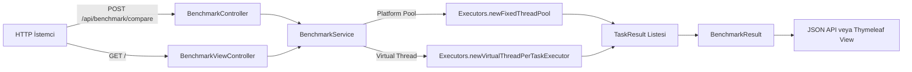

# 🚀 Virtual Thread Benchmark - Spring Boot

<div align="center">
  <h3>Proje Mimarisi</h3>



</div>

- ✅ Platform thread havuzu ve virtual thread davranışını aynı iş yükünde kıyaslar
- ✅ Gerçek I/O benzetimi için `Thread.sleep(...)` tabanlı task modeli kullanır
- ✅ REST API ve web arayüzü üzerinden benchmark çalıştırır
- ✅ Sonuçları toplam süre, ortalama task süresi, throughput ve başarı oranlarıyla döner
- ✅ Spring Boot + Gradle + JUnit ile geliştirilmiştir

---

## 📌 Bu Proje Nedir?

`virtual-thread-demo`, aynı sayıda I/O benzeri task için:

- klasik sabit boyutlu platform thread havuzunu
- task-başına virtual thread yaklaşımını

karşılaştırmak için hazırlanmış bir benchmark uygulamasıdır.

Proje iki kanal sunar:

- **REST API**: JSON sonuç döner
- **Web arayüzü**: `benchmark.html` üzerinden form ile test koşar

---

## 🧠 Benchmark Akışı

1. İstekteki parametreler (`taskCount`, `ioDelayMs`, `threadPoolSize`) alınır
2. `BenchmarkService` platform ve virtual senaryoları çalıştırır
3. Her task için süre, thread tipi ve başarı bilgisi toplanır
4. Toplam süre, ortalama task süresi ve throughput hesaplanır
5. Sonuç JSON veya HTML model olarak dönülür

Kullanılan ana modeller:

- `BenchmarkRequest`
- `BenchmarkResult`
- `TaskResult`

---

## 📂 Proje Yapısı

```text
src/main/java/com/demo/
├── VirtualThreadDemoApplication.java
├── controller/
│   ├── BenchmarkController.java
│   └── BenchmarkViewController.java
├── model/
│   ├── BenchmarkRequest.java
│   ├── BenchmarkResult.java
│   └── TaskResult.java
└── service/
    └── BenchmarkService.java

src/main/resources/
├── application.yml
└── templates/
    └── benchmark.html

src/test/java/com/demo/service/
└── BenchmarkServiceTest.java
```

---

## 🚀 Kurulum ve Çalıştırma

### 1) Gereksinimler

- Java 21 (toolchain ayarı: `build.gradle`)
- Gradle

### 2) Projeyi Derle ve Test Et (Windows Command)

```bat
cd /d "C:\Users\Mehmet Furkan\Desktop\virtual-thread-demo"
gradle clean test
```

### 3) Uygulamayı Başlat

```bat
cd /d "C:\Users\Mehmet Furkan\Desktop\virtual-thread-demo"
gradle bootRun
```

Uygulama varsayılan olarak `http://localhost:8080` adresinde çalışır.

---

## 📮 API Endpoint'leri

Temel base path: `/api/benchmark`

| Endpoint | Metot | Açıklama |
|----------|-------|----------|
| `/api/benchmark/compare` | POST | Platform + virtual benchmark'i birlikte çalıştırır |
| `/api/benchmark/virtual` | POST | Yalnızca virtual thread benchmark'i |
| `/api/benchmark/platform` | POST | Yalnızca platform pool benchmark'i |
| `/api/benchmark/health` | GET | Uygulama/JDK sağlık kontrolü |
| `/` | GET | Web benchmark sayfası |
| `/benchmark` | POST | Form üzerinden benchmark çalıştırır |

### Örnek İstek (compare)

```http
POST http://localhost:8080/api/benchmark/compare
Content-Type: application/json

{
  "taskCount": 300,
  "ioDelayMs": 100,
  "threadPoolSize": 50
}
```

### Örnek Yanıt (kısaltılmış)

```json
{
  "platform": {
    "label": "Platform Threads (pool=50)",
    "taskCount": 300,
    "ioDelayMs": 100,
    "totalElapsedMs": 680,
    "avgTaskMs": 101.2,
    "throughputPerSecond": 441.2,
    "successCount": 300,
    "failCount": 0,
    "taskResults": []
  },
  "virtual": {
    "label": "Virtual Threads",
    "taskCount": 300,
    "ioDelayMs": 100,
    "totalElapsedMs": 190,
    "avgTaskMs": 100.4,
    "throughputPerSecond": 1578.9,
    "successCount": 300,
    "failCount": 0,
    "taskResults": []
  }
}
```

Not: Süreler ortama göre değişir; değerler temsilidir.

---

## ✅ Testler

`BenchmarkServiceTest` sınıfı şu senaryoları doğrular:

- Virtual thread tüm task'ları tamamlar
- Küçük platform pool daha yavaş kalır
- Virtual thread, küçük pool'a göre daha hızlı olur
- Task'lar doğru thread tipinde çalışır (`virtual` / `platform`)

Çalıştırma:

```bat
cd /d "C:\Users\Mehmet Furkan\Desktop\virtual-thread-demo"
gradle test
```

---

## 🔧 Konfigürasyon

`src/main/resources/application.yml`:

```yaml
spring:
  application:
    name: virtual-thread-demo
  threads:
    virtual:
      enabled: true

server:
  port: 8080
  tomcat:
    threads:
      max: 200

logging:
  level:
    com.demo: DEBUG
```

---

## 📚 Bağımlılıklar

`build.gradle` içindeki temel bağımlılıklar:

```groovy
implementation 'org.springframework.boot:spring-boot-starter-webmvc'
implementation 'jakarta.xml.bind:jakarta.xml.bind-api'
runtimeOnly 'org.glassfish.jaxb:jaxb-runtime'

compileOnly 'org.projectlombok:lombok'
annotationProcessor 'org.projectlombok:lombok'

testImplementation 'org.springframework.boot:spring-boot-starter-test'
testRuntimeOnly 'org.junit.platform:junit-platform-launcher'
```

---

## 🐛 Sorun Giderme

### `isVirtual()` veya `newVirtualThreadPerTaskExecutor()` çözümlenmiyor

- Java sürümünü kontrol edin:

```bat
java -version
```

- Proje Java 21 toolchain ile ayarlıdır; IDE'nin project SDK ayarı da Java 21 olmalıdır.

### Uygulama açılıyor ama `/` endpoint'i hata veriyor

- Bu endpoint Thymeleaf template (`benchmark.html`) döndürür.
- Gerekirse `spring-boot-starter-thymeleaf` bağımlılığını projeye ekleyin.

### 8080 portu dolu

- `application.yml` içinde `server.port` değerini değiştirin.

### Sonuçlar beklenenden farklı

- `taskCount`, `ioDelayMs` ve `threadPoolSize` değerlerini sabitleyip tekrar deneyin.
- Farklı makine yüklerinde throughput doğal olarak değişir.

---

## ✍️ Geliştirici Notu

Bu proje, virtual thread yaklaşımının I/O ağır senaryolarda sağladığı farkı pratik olarak göstermek için tasarlanmıştır.

